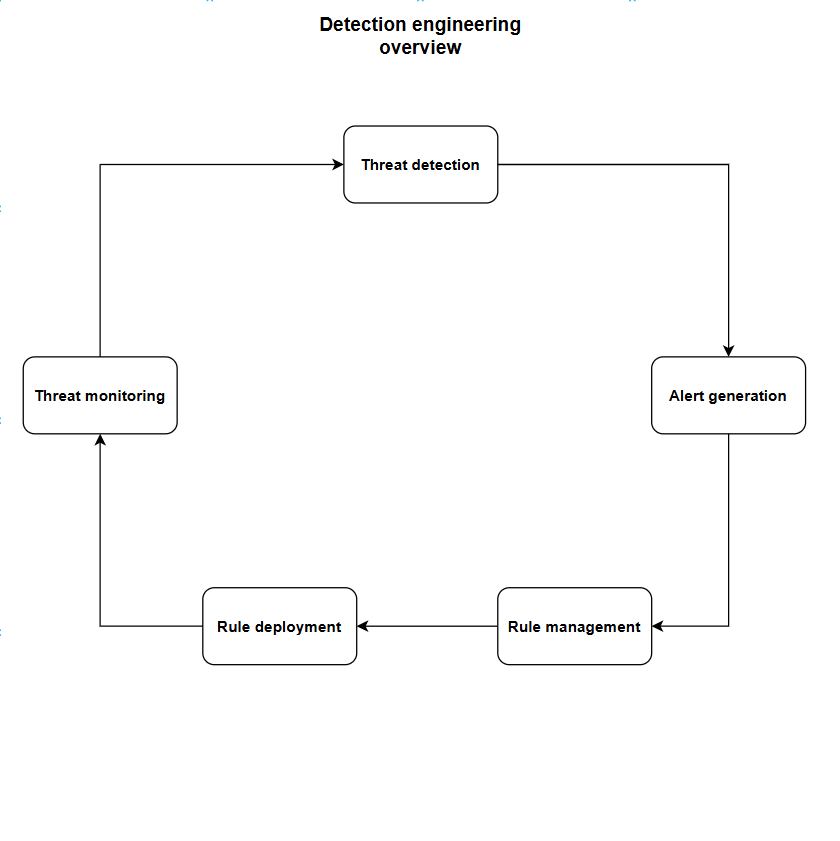

# Detection-engineering
A hands-on Detection Engineering lab for building, testing, managing, and deploying detection rules using Detection-as-Code, GitHub, and SIEM.
# What is Detection Engineering?

Detection Engineering is a proactive security approach focused on designing, building, testing, deploying, and maintaining detection rules that identify suspicious or malicious activity. It transforms raw security logs and data into meaningful alerts, helping security teams detect threats early and respond before they cause significant damage.

# Detection Engineering Lifecycle

## Threat Detection

Threat Detection means identifying the malicious or suspicious behavior that we want our security tools to detect. Detection engineering starts by understanding what attackers actually do in an environment. For example, an attacker may steal an employee’s password, log into their account, and use PowerShell to download malicious software. Frameworks such as MITRE ATT&CK can be used to understand common attacker techniques and behaviors. The goal is to understand this attacker behavior and define what needs to be detected.

## Alert Generation

Alert Generation means converting the identified attacker behavior into a detection rule by writing custom code or queries. The SIEM does not automatically know that every activity is malicious, so we create rules that tell it what behavior should generate an alert. For example, if we know attackers use PowerShell to download malicious files, we can create a rule such as:

> “If PowerShell downloads an executable from a suspicious external location, generate an alert.”

This turns our knowledge of attacker behavior into something that can be detected automatically. The goal is to turn this activity into accurate alerts that help security teams detect threats while avoiding false alarms.

## Rule Management

Rule Management is where detection rules are stored, reviewed, and maintained in GitHub. Instead of keeping rules on individual computers, the security team uses a central GitHub repository to organize and manage them. For example, a detection engineer may create a file such as `suspicious_powershell.yml` containing the detection logic, severity, and other rule information.

Other security engineers can review the rule, suggest changes, and approve it. GitHub also keeps a history of changes, making it easier to track and manage detection rules. With Detection-as-Code, rules can be managed like software by using GitHub for version control, peer reviews, and tracking changes.

## Rule Deployment

Rule Deployment means moving approved detection rules from GitHub to the SIEM or EDR so they can be used for security monitoring. A detection rule stored in GitHub cannot detect activity by itself. It needs to be synchronized or deployed to the SIEM or EDR.

For example, a rule such as “Detect suspicious PowerShell downloads” is stored in GitHub and then synchronized with the SIEM or EDR. Once deployed, the SIEM or EDR can use that rule to analyze incoming security logs.

## Threat Monitoring

Threat Monitoring is where the SIEM continuously examines security logs and checks them against the deployed detection rules. Logs can come from Windows, Linux, EDR, firewalls, cloud services, and applications.

When the SIEM finds activity that matches a detection rule, it generates a security alert. For example, if an attacker uses PowerShell to download a malicious executable, the SIEM detects the matching behavior and generates an alert such as:

> “High Severity: Suspicious PowerShell Download.”

# Advantages

Detection Engineering provides early threat detection, improves visibility into attacker behavior, reduces manual monitoring, and helps security teams identify known and emerging threats. It also reduces false alerts through testing and tuning, while Detection-as-Code enables version control, peer reviews, and consistent management of detection rules.

# Disadvantages

Detection Engineering requires continuous maintenance and tuning because attackers constantly change their techniques. Poorly designed rules can generate too many false alerts, creating alert fatigue for security analysts. It also requires skilled security engineers, proper log sources, and ongoing testing to keep detections effective.

# Example

An attacker uses PowerShell to download a malicious file. A detection engineer studies this behavior and creates a rule to identify suspicious PowerShell downloads. The rule is tested to ensure it detects the attack without generating excessive false alerts, stored and reviewed using version control, and then deployed to the SIEM.

When the attacker performs the activity, the SIEM matches the event against the rule and generates a security alert for investigation.
