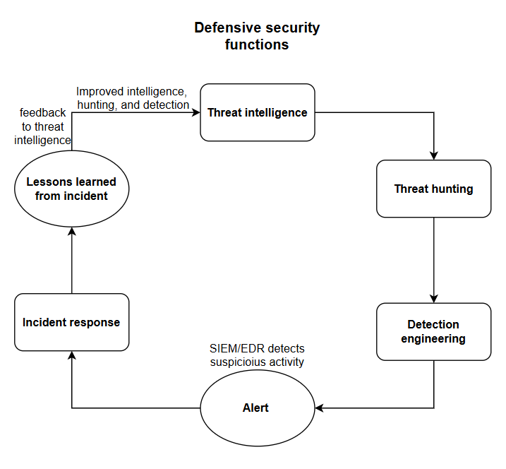

# Defensive Security Operations in a SOC

These four areas are core parts of defensive security operations in a SOC (Security Operations Center). They work together as a continuous defensive cycle. Threat Intelligence, Threat Hunting, Detection Engineering, and Incident Response are not isolated activities. They continuously feed information back into each other to improve the organization's ability to detect, investigate, and respond to threats.

### 1. Threat Intelligence

Threat Intelligence is the process of collecting and understanding information about attackers, their tools, techniques, and behaviors. The goal is to know what threats your organization may face and what indicators or techniques can help identify them. For example, security researchers may discover that a particular attacker group uses a specific malicious IP address, malware, phishing emails, or PowerShell commands. The SOC collects and analyzes this information so analysts can use it to protect the organization. Threat Intelligence provides ideas about what threat hunters should search for. For example, threat intelligence may reveal that attackers are currently using PowerShell to move laterally between Windows machines. Based on this information, the threat hunter can search the organization's environment for unusual PowerShell activity, suspicious commands, or unexpected connections between systems. In simple terms, **Threat Intelligence answers: “What do we know about the attackers?”** and **“What do attackers do?”**

### 2. Threat Hunting

Threat Hunting is the process of actively searching the organization's environment for attackers or suspicious activity that may not have triggered an existing security alert. Instead of waiting for the SIEM or EDR to generate an alert, threat hunters proactively investigate logs, endpoints, network traffic, and user activity. For example, Threat Intelligence may reveal that an attacker commonly uses PowerShell for lateral movement. A threat hunter could search the organization's logs for unusual PowerShell activity, such as commands being executed at 3 AM on an employee's computer. If suspicious activity is discovered, it may indicate that an attacker is already inside the environment.

Threat Hunting can also discover suspicious behavior that existing security tools are not currently detecting. For example, a threat hunter may discover that an employee's computer is running an unusual PowerShell command and connecting to an external server, but no security alert was generated. The threat hunter can provide this finding to the detection engineering team. Therefore, **Threat Intelligence tells you what to look for, while Threat Hunting actively looks for it.** In simple terms, **Threat Hunting answers: “Is an attacker already hiding in our environment?”** and **“Are they doing it here?”**

### 3. Detection Engineering

Detection Engineering is the process of creating and improving security rules, queries, alerts, and detection logic that automatically identify suspicious activity. If threat hunters repeatedly discover the same malicious behavior, the organization can create an automated detection for it. For example, if attackers frequently use a particular suspicious PowerShell technique, a detection engineer can create a SIEM or EDR rule that detects that behavior and generates an alert for the SOC analyst. This reduces the need for analysts to manually search for the same activity repeatedly.

Threat Hunting can discover suspicious behavior that is not currently detected, and Detection Engineering can turn that knowledge into an automated detection. For example, the hunter discovers a suspicious pattern involving PowerShell, an unusual command, and a connection to an external server. The detection engineer can create a detection rule for this behavior. Therefore, **Threat Hunting discovers suspicious behavior, while Detection Engineering turns that knowledge into an automated detection.** In simple terms, **Detection Engineering answers: “How can we automatically detect the attacker?”**

### 4. Incident Response

Incident Response is the process of investigating, containing, removing, and recovering from a confirmed security incident. It begins when suspicious activity is identified and the SOC determines that a real compromise has occurred. Detection Engineering creates the alerts and detection mechanisms that help the SOC identify potential attacks. For example, a detection rule may say, **“Alert when suspicious PowerShell behavior occurs.”** When an attacker performs that behavior, the SIEM generates an alert such as **“Suspicious PowerShell Activity Detected.”** The incident response team then investigates the alert to determine whether it represents a real attack.

If the investigation confirms that the computer has been compromised, the incident response team may isolate the computer from the network, disable the compromised account, remove the malware, reset credentials, check other systems for compromise, and restore affected systems. Afterward, the team performs lessons learned and improves security controls. Therefore, **Detection Engineering creates the alarm, while Incident Response investigates and responds when the alarm goes off.** In simple terms, **Incident Response answers: “The attacker is here—what do we do now?”**

### 5. Incident Response → Threat Intelligence

Incident Response can generate new threat intelligence from real security incidents. During an investigation, incident responders may discover a malicious IP address, malware family, compromised account, or attacker technique. For example, responders may discover that an attacker used a particular malware, PowerShell commands, stolen credentials, or a specific external server. This information can be documented and added to the organization's threat intelligence.

The new information can then be used by threat hunters and detection engineers to improve future searches and detections. Therefore, **Incident Response discovers new information about attackers, and Threat Intelligence uses that information to improve the organization's understanding of threats.** This creates the feedback loop that allows the SOC to continuously learn from real attacks.

### How the Four Work Together

The four functions form a continuous defensive cycle. **Threat Intelligence tells the SOC what attackers do and what to look for. Threat Hunting checks whether attackers are doing it inside the organization. Detection Engineering turns discovered attacker behavior into automated detections. The SIEM or EDR generates an alert when suspicious activity is detected. Incident Response investigates, contains, removes, and recovers from the attack. Lessons learned from the incident then improve Threat Intelligence, Threat Hunting, and Detection Engineering.**

### Simple Scenario

Imagine an attacker is targeting a company and commonly uses **PowerShell and stolen credentials**. Threat Intelligence tells the SOC that this attacker uses PowerShell and stolen credentials. Threat Hunting then searches the organization's logs and endpoints for unusual PowerShell activity and suspicious credential use. The threat hunter discovers a suspicious pattern that is not currently detected, so Detection Engineering creates a rule to automatically detect it.

The attacker performs the suspicious activity, and the SIEM or EDR generates an alert: **“Suspicious PowerShell Activity Detected.”** Incident Response investigates and confirms that it is a real attack. The team isolates the affected machine, disables the compromised account, removes the malware if present, resets credentials, and checks whether other systems were affected.

During the investigation, the team discovers a new attacker technique. This information becomes new Threat Intelligence, which helps improve future Threat Hunting and Detection Engineering. **The cycle then starts again.**

The easiest way to remember the relationship is:

**Threat Intelligence tells you what to look for → Threat Hunting searches for it → Detection Engineering automates the detection → Incident Response stops the attack → Lessons Learned improves Threat Intelligence and Detection.**
