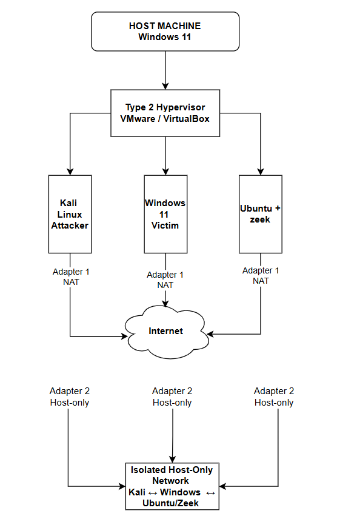

## 1. VMware Workstation / VirtualBox Installation

* Install VMware Workstation or VirtualBox.
* Configure **Virtual Network Adapter 1** as **NAT** for Internet connectivity.
* Configure **Virtual Network Adapter 2** as a **Host-Only Adapter** for the isolated lab network.
* Create and verify the Host-Only network configuration.

### Network Architecture



## 2. Kali Linux – Attacker Machine

* Install Kali Linux.
* Configure **Network Adapter 1 → NAT**.
* Configure **Network Adapter 2 → Host-Only Adapter**.
* Check the Host-Only adapter IP address.
* Verify network connectivity with the Windows 11 VM by pinging its Host-Only IP address.

## 3. Windows 11 – Victim Machine

* Install Windows 11.
* Configure **Network Adapter 1 → NAT**.
* Configure **Network Adapter 2 → Host-Only Adapter**.
* Check the Host-Only adapter IP address.
* Ping the Kali Linux Host-Only IP address to verify network connectivity.

## 4. Disable Microsoft Defender Antivirus on Windows 11

### Windows Security

* Open **Windows Security**.
* Go to **Virus & threat protection**.
* Open **Virus & threat protection settings**.
* Configure the required Defender settings for the isolated lab environment.

### Advanced Configuration Using Group Policy

* Open **Windows PowerShell** or **Run**.

* Execute:

  ```text
  gpedit.msc
  ```

* Navigate to:

  **Computer Configuration → Administrative Templates → Windows Components → Microsoft Defender Antivirus**

* Configure **Turn off Microsoft Defender Antivirus**.

* Set it to **Enabled**.

* Click **Apply** and **OK**.

* Navigate to:

  **Microsoft Defender Antivirus → Real-time Protection**

* Configure **Turn off real-time protection**.

* Set it to **Enabled**.

* Click **Apply** and **OK**.

* Configure **Turn off behavioral monitoring**.

* Set it to **Enabled**.

* Click **Apply** and **OK**.

* Open **Windows Security → Virus & threat protection**.

* Verify that the settings indicate they are **managed by your administrator**.

## 5. Ubuntu OS – Zeek Sensor

* Install Ubuntu Linux.
* Configure **Network Adapter 1 → NAT**.
* Configure **Network Adapter 2 → Host-Only Adapter**.
* Open the adapter's **Advanced** settings.
* Configure the appropriate **Adapter Type** for the virtual network adapter.
* Set **Promiscuous Mode → Allow All** for the Host-Only adapter.
* Check the Host-Only adapter IP address.
* Ping the Kali Linux Host-Only IP address to verify network connectivity.
* Take a **snapshot of the clean Ubuntu VM state** before configuring Zeek.

## 6. Zeek Installation

* Install Zeek using the official Zeek installation documentation:
  **https://docs.zeek.org/en/master/install.html**
* Verify that Zeek is installed correctly.

## 7. Zeek Network Configuration

* Check the Host-Only adapter IP address on Ubuntu.
* Navigate to the Zeek configuration directory:

  ```bash
  cd /opt/zeek/etc
  ```
* Open the `networks.cfg` file:

  ```bash
  nano networks.cfg
  ```
* Add the Host-Only network address using CIDR notation.
* Example:

  * Host-Only IP: `192.168.209.128`
  * Host-Only network: `192.168.209.0/24`

## 8. Zeek Interface Configuration

* Open the Zeek node configuration:

  ```bash
  nano node.cfg
  ```
* Remove the existing interface name.
* Add the interface name of the **Host-Only adapter**.
* Ensure that Zeek monitors the Host-Only network interface rather than the NAT interface.

## 9. Final Lab Architecture

* **Virtual Adapter 1:** NAT — Internet connectivity.
* **Virtual Adapter 2:** Host-Only — isolated security lab network.
* **Kali Linux:** Attacker machine.
* **Windows 11:** Victim machine.
* **Ubuntu:** Zeek monitoring/sensor machine.
* **Zeek:** Monitors network traffic on the Host-Only interface.
