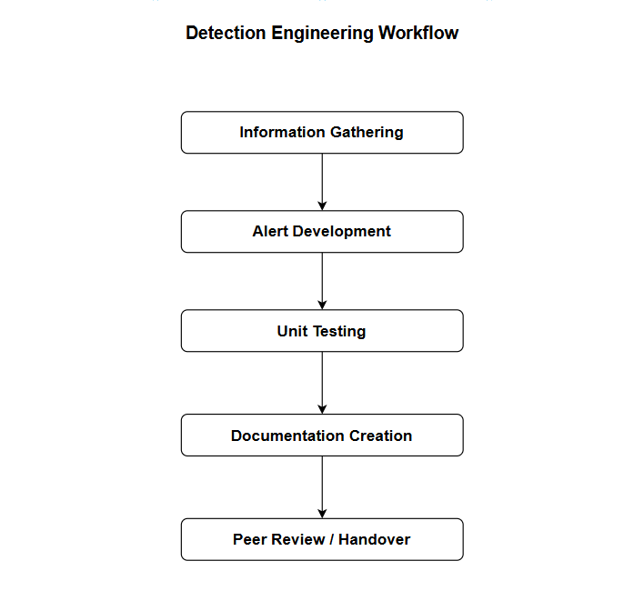
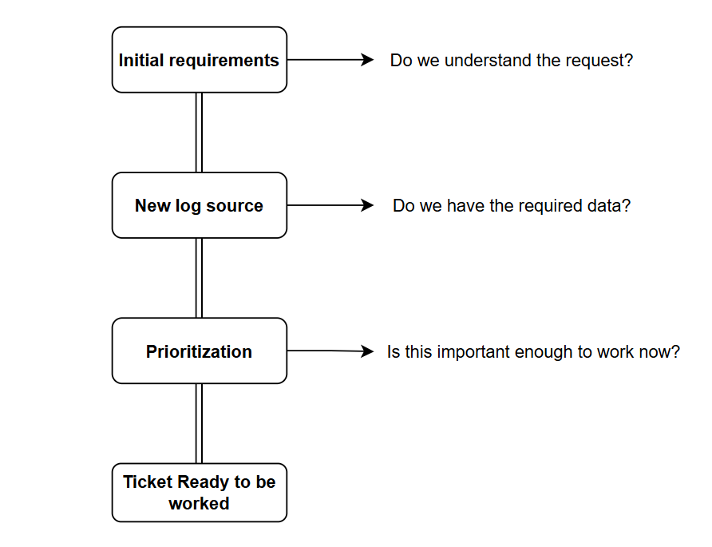

# Detection Engineering Workflow

## Information Gathering

Information Gathering is the process of collecting the information and data needed to build a detection. Before creating an alert, you need to understand what logs are available, what security tools exist, and where the relevant activity can be found. For example, suppose you want to detect suspicious PowerShell activity. First, you determine what logs are available, such as Windows Event Logs, endpoint logs, SIEM logs, and network logs, and where you can query them, such as the SIEM or log platform. You might discover that PowerShell events are available in Windows Event Logs. In simple terms, **Information Gathering means: “Find the data, logs, and tools needed to build the detection.”**

### 1. Initial Requirements

Initial Requirements means understanding exactly what detection is being requested and collecting all necessary information. You don't want to start building a detection without knowing what you're supposed to detect. You should ask: What exactly do we need to detect? Is enough information provided? Are there related tickets? Is there existing documentation? For example, a ticket may say, **“Create a detection for suspicious PowerShell activity.”** Before starting, you check what behavior needs to be detected, which users or systems are involved, which logs are available, whether there were any previous incidents, and whether there is any related documentation. In simple terms, **Initial Requirements means: “Understand exactly what needs to be detected.”**

### 2. New Log Source

New Log Source means checking whether the data or logs needed for the detection are actually available. You cannot create a reliable detection if the SIEM doesn't have the required data. For example, if you want to detect **“Suspicious PowerShell commands,”** you need PowerShell, Windows, or EDR logs. You check whether the required data is being collected, whether it is reaching the SIEM, and whether you can search it. If the required logs aren't available, you may need to configure a new log source. You might also check the vendor's documentation to understand what fields the logs contain. In simple terms, **New Log Source means: “Do we have the data required to build the detection?”**

### 3. Prioritization

Prioritization means deciding how important and urgent the detection request is compared with other work. Detection engineers usually have many requests, and they can't necessarily work on everything at the same time. For example, suppose you have three tickets: **Ticket A → Detect ransomware — HIGH**, **Ticket B → Detect suspicious login — MEDIUM**, and **Ticket C → Detect unusual USB use — LOW**. You might work on the ransomware detection first because it represents a higher risk. You ask, **“Does this need to be done ASAP?”** and **“How does this compare with the existing backlog?”** In simple terms, **Prioritization means: “What should we work on first?”**

### After These Three Checks

The process can be understood as:

### One Simple Example

A SOC manager sends a ticket: **“Create a detection for suspicious PowerShell downloads.”** The detection engineer first checks the requirements and asks, **“What exactly counts as suspicious?”** Next, the engineer checks the logs and asks, **“Do we have PowerShell and network logs in the SIEM?”** Finally, the engineer checks the priority and asks, **“Is this related to an active threat? Should I do it today?”** If everything is available and the priority is clear, the **ticket is ready to be worked**. Then the detection engineer moves to the next stage: **Alert Development**.
