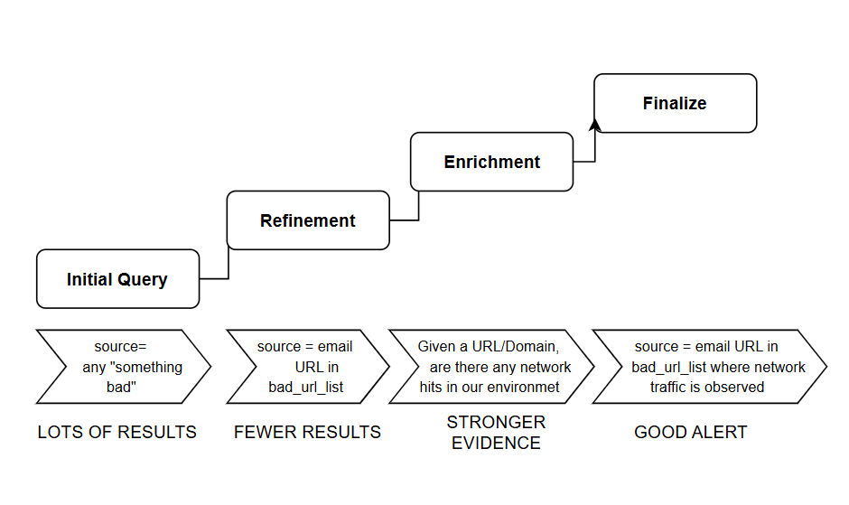
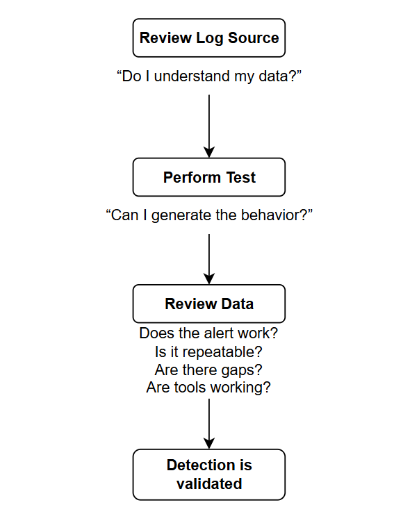

# Detection Engineering Workflow

## Information Gathering

Information Gathering is the process of collecting the information and data needed to build a detection. Before creating an alert, you need to understand what logs are available, what security tools exist, and where the relevant activity can be found. For example, suppose you want to detect suspicious PowerShell activity. First, you determine what logs are available, such as Windows Event Logs, endpoint logs, SIEM logs, and network logs, and where you can query them, such as the SIEM or log platform. You might discover that PowerShell events are available in Windows Event Logs. In simple terms, **Information Gathering means: “Find the data, logs, and tools needed to build the detection.”**

### 1. Initial Requirements

Initial Requirements means understanding exactly what detection is being requested and collecting all necessary information. You don't want to start building a detection without knowing what you're supposed to detect. You should ask: What exactly do we need to detect? Is enough information provided? Are there related tickets? Is there existing documentation? For example, a ticket may say, **“Create a detection for suspicious PowerShell activity.”** Before starting, you check what behavior needs to be detected, which users or systems are involved, which logs are available, whether there were any previous incidents, and whether there is any related documentation. In simple terms, **Initial Requirements means: “Understand exactly what needs to be detected.”**

### 2. New Log Source

New Log Source means checking whether the data or logs needed for the detection are actually available. You cannot create a reliable detection if the SIEM doesn't have the required data. For example, if you want to detect **“Suspicious PowerShell commands,”** you need PowerShell, Windows, or EDR logs. You check whether the required data is being collected, whether it is reaching the SIEM, and whether you can search it. If the required logs aren't available, you may need to configure a new log source. You might also check the vendor's documentation to understand what fields the logs contain. In simple terms, **New Log Source means: “Do we have the data required to build the detection?”**

### 3. Prioritization

Prioritization means deciding how important and urgent the detection request is compared with other work. Detection engineers usually have many requests, and they can't necessarily work on everything at the same time. For example, suppose you have three tickets: **Ticket A → Detect ransomware — HIGH**, **Ticket B → Detect suspicious login — MEDIUM**, and **Ticket C → Detect unusual USB use — LOW**. You might work on the ransomware detection first because it represents a higher risk. You ask, **“Does this need to be done ASAP?”** and **“How does this compare with the existing backlog?”** In simple terms, **Prioritization means: “What should we work on first?”**

### After These Three Checks

The process can be understood as:


### One Simple Example

A SOC manager sends a ticket: **“Create a detection for suspicious PowerShell downloads.”** The detection engineer first checks the requirements and asks, **“What exactly counts as suspicious?”** Next, the engineer checks the logs and asks, **“Do we have PowerShell and network logs in the SIEM?”** Finally, the engineer checks the priority and asks, **“Is this related to an active threat? Should I do it today?”** If everything is available and the priority is clear, the **ticket is ready to be worked**. Then the detection engineer moves to the next stage: **Alert Development**.

## Alert Development

Alert Development is the process of using the gathered information to develop the actual detection and alert. Now that you understand the available logs and security tooling, you can create and refine a query that identifies suspicious activity. The main idea is to **start with a broad query, then gradually make it more specific until you have a useful and reliable alert**. For example, you might start with `powershell.exe`, then refine it to `powershell.exe + EncodedCommand`, and then add additional context such as `powershell.exe + EncodedCommand + Suspicious Parent Process + External Network Connection`. You can also review existing security tools to determine whether they already detect this behavior. In simple terms, **Alert Development means: “Build and refine the detection using available logs and security tools.”**

### 1. Initial Query

Initial Query means starting with a broad search to find relevant activity. At the beginning, you don't know exactly what the data looks like. If you make the query too specific immediately, you might miss important information. For example, suppose you want to detect a malicious website. You might search for `"somethingbad.com"` across all available data. You are basically asking, **“Show me anything related to this domain.”** You may get lots of results, but this helps you understand what data is available and where the relevant activity appears. In simple terms, **Initial Query means: “Start broad and see what the data looks like.”**

### 2. Refinement

Refinement means making the query more specific. The initial query may produce too many results, so you want to reduce irrelevant results and focus on suspicious activity. For example, instead of searching for `"somethingbad.com"` across all sources, you may discover that the useful data comes from email logs. You can then narrow the query to something like:

```text
source = email
URL in bad_url_list
```

Now you are asking, **“Show me emails containing URLs that are known to be bad.”** In simple terms, **Refinement means: “Narrow the search to reduce unnecessary results.”**

### 3. Enrichment

Enrichment means adding more information or context to the detection. A single indicator isn't always enough to determine whether something is actually malicious. You want additional information to make the alert more useful and provide stronger evidence.

For example, you may detect an email containing:

```text
http://somethingbad.com
```

You can then ask, **“Did any computer in our environment actually connect to this domain?”**

By combining email data with network data, you can identify that an email contained a bad URL and that network traffic to that URL was also observed. This provides much stronger evidence. In simple terms, **Enrichment means: “Add more context so we can better understand the activity.”**

### 4. Finalize

Finalize means turning the refined and enriched query into the final production detection. The goal is for the SOC to receive a useful alert rather than a huge number of irrelevant alerts.

The final query may essentially look for:

```text
source = email

AND

URL is in bad_url_list

AND

network traffic to that URL was observed
```

Now the alert has much stronger evidence: a user received an email containing a known malicious URL, and a system actually connected to that URL. This makes the detection much more valuable to the analyst because it provides multiple pieces of evidence. In simple terms, **Finalize means: “Turn the tested, useful query into a production-ready alert.”**

### Why Start High Level and Narrow as You Go?

The process can be understood like using a funnel:


The reason for starting with a broad query is that you first want to understand what the data looks like and avoid missing important activity. As you learn more about the data, you gradually refine the query, reduce irrelevant results, and add additional context.

### Example from the Detection

#### Step 1 — Broad

`"somethingbad.com"` appears anywhere.

#### Step 2 — Refined

The URL appears specifically in an email.

#### Step 3 — Enriched

Did a computer in our environment actually communicate with that URL?

#### Step 4 — Final

An email contained a known bad URL **AND** network traffic to that URL was observed.

That final detection is much more valuable because it gives the analyst **multiple pieces of evidence** instead of relying on a single indicator.
## Unit Testing

The main idea of Unit Testing is to **test the detection before putting it into production to make sure it actually works**. Unit Testing means testing the detection logic in a controlled way before using it in production. You need to verify that the detection actually identifies the behavior you're looking for and doesn't trigger incorrectly. For example, suppose your detection is designed to identify **PowerShell + Encoded Command**. You create a test event, the detection query processes the activity, the condition matches, and an alert is generated. You then test legitimate PowerShell activity to make sure the condition does not match and no alert is generated. In simple terms, **Unit Testing means: “Prove that the detection works correctly before deploying it.”**

### 1. Review Log Source

Review Log Source means first understanding and reviewing the logs that the detection will use. You need to know what information is available in the logs and what the fields actually mean. For example, if you want to detect suspicious PowerShell activity, you review the Windows or EDR logs and check what fields exist, such as **User, Host, Process, Command line, Parent process, Timestamp, and Network connection**. You might discover that the command-line field is called `process.command_line`. Understanding these fields is important before writing and testing the detection. In simple terms, **Review Log Source means: “Understand the data before writing/testing the detection.”**

### 2. Perform Test

Perform Test means running a controlled test to see whether the detection identifies the behavior you are trying to detect. You need to prove that the detection works in a real situation rather than assuming the query is correct. For example, if your detection is designed to identify suspicious PowerShell execution, you perform a safe test that produces the relevant log activity. You then check whether the test activity generates logs, whether the detection searches those logs, and whether the detection triggers. If the expected behavior occurs and the alert triggers, the detection works. In simple terms, **Perform Test means: “Create the behavior and see whether the detection catches it.”**

### 3. Review Data

After performing the test, Review Data means examining the resulting logs and alert. You need to make sure the detection triggered for the right reason and that the data is accurate. This stage helps validate the detection from several perspectives, including confirming the alert logic, checking whether the detection is repeatable, identifying detection gaps, and validating the security tools and data pipeline.

**A. Confirm Alert Logic:** Make sure the alert triggered because of the intended behavior. For example, you wanted **Suspicious PowerShell → Alert**. You perform the test, the suspicious PowerShell activity occurs, the detection matches, and the alert is generated. This confirms that the logic works. The question is: **“Did my detection catch what I intended?”**

**B. Repeatable:** The same test should produce the same result consistently. A detection shouldn't work once and randomly fail the next time. For example, you run the test five times and receive an alert each time: **Test 1 → Alert, Test 2 → Alert, Test 3 → Alert, Test 4 → Alert, Test 5 → Alert**. This is a good sign that the detection is reliable. The question is: **“Can I reliably reproduce the detection?”**

**C. Gap Identification:** Testing can reveal weaknesses or gaps in your detection. Attackers may perform the same technique in slightly different ways. For example, your detection may catch **PowerShell + suspicious download → Alert**, but when you test another variation such as **PowerShell + encoded command → No alert**, you have discovered a detection gap. You can then improve the rule to cover the missing behavior. The question is: **“What malicious behavior can my detection NOT see?”**

**D. Tooling Validation:** Make sure the security tools and data pipeline are working correctly. Sometimes the detection isn't the problem—the logs or security tools may be. For example, you perform the test, but no logs appear in the SIEM. The problem might be with the endpoint or the log collection pipeline. In this situation, you need to fix the log collection rather than changing the detection. The question is: **“Are my tools and data working correctly?”**

### Complete Unit Testing Process

The complete unit testing process can be understood as:

